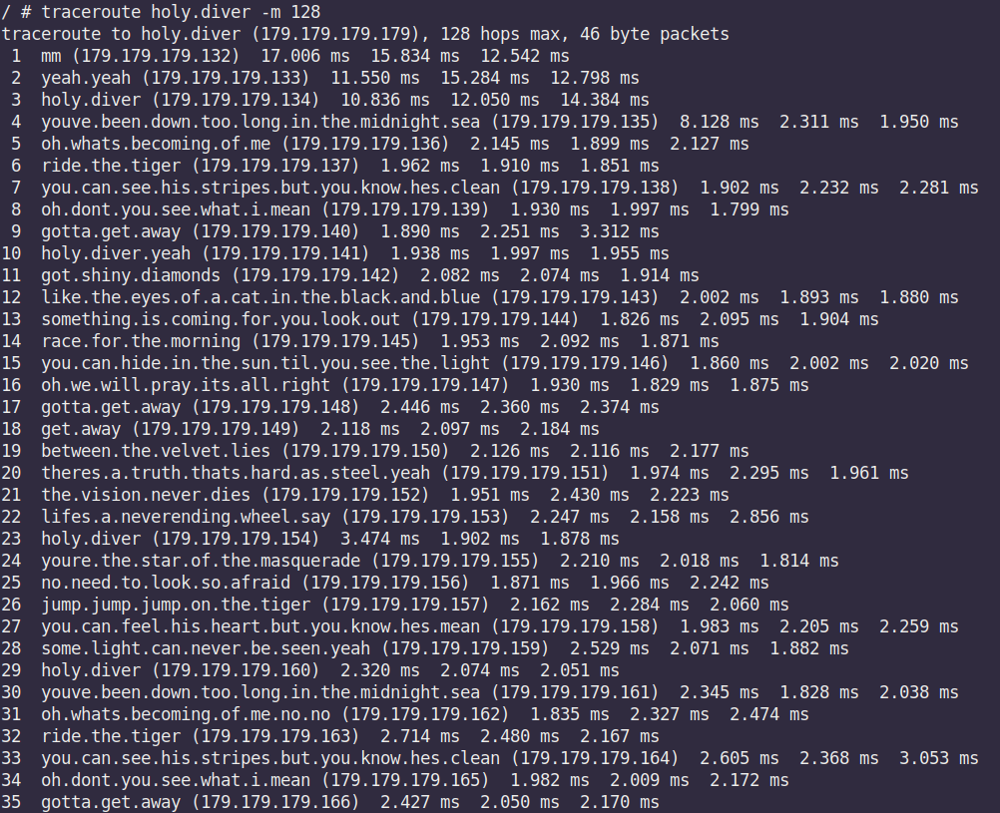
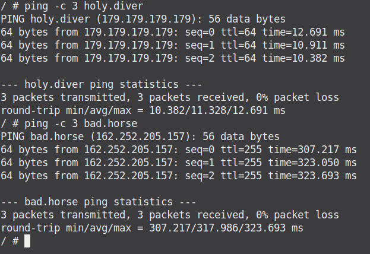

# Запуск
Это питоновский  скрипт,  которому нужно указать флаги:
- `-l` Интерфейс, подсоединенный к локальной сети. То есть тот, откуда будут tracerout'ить.
- `-c` Интерфейс, подключенный к интернету.

По умолчанию текст песни читается из файла `holy.diver.txt`, его тоже можно изменить (см `-h`).

# Результат
Поддерживает UDP и ICMP traceroute.
Ниже скриншоты, трассы приложены.
`bad.horse` я не только пинговал, потому что traceroute из-под gns долгий.

